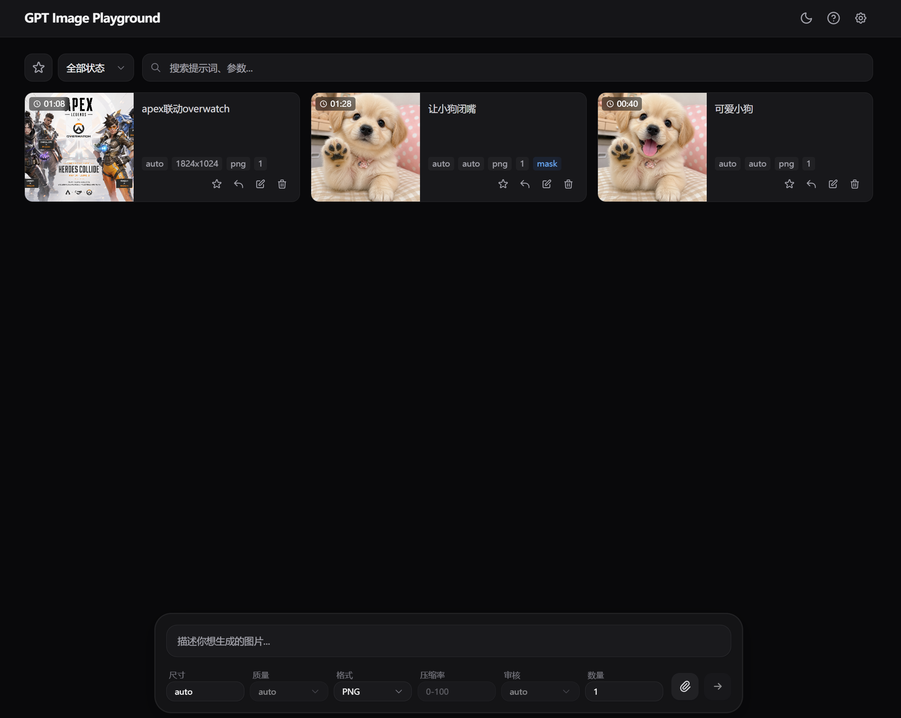
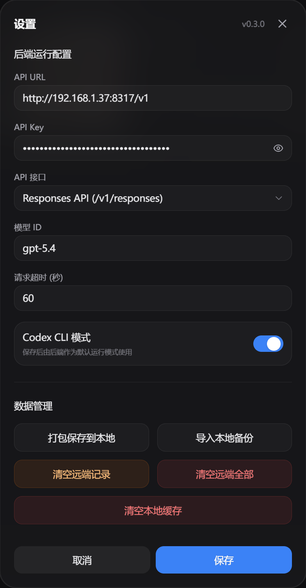
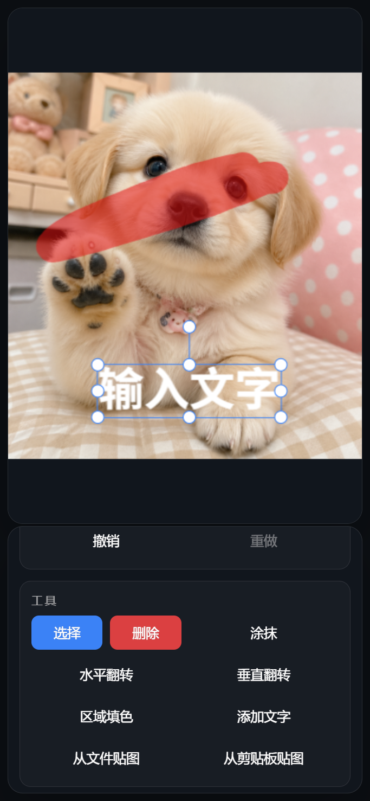

# GPT Image Playground

<p align="center">
  
  
</p>
<p align="center">
  
  
</p>

## Render一键部署

[](https://render.com/deploy?repo=https://github.com/XianYuDaXian/gpt_image_playground)

**请注意** Render 一键部署仅供**临时测试**：

- 当前 `render.yaml` 不挂持久盘
- 服务重启、重建或重新部署后，数据库与图片文件都会丢失
- 如需正式使用，请自行在 Render 或其他平台配置持久化存储

---

基于 OpenAI 图像接口的图片生成与编辑工具，当前版本已经重构为**前后端一体**架构：

- 前端只负责界面与编辑交互
- 后端统一保存 `API URL / API Key / model / timeout`
- 任务由后端发起、排队、落盘和回看
- 输入图、遮罩图、输出图都会先保存到后端本地，再由前端显示
- 不再依赖 WebDAV

本仓库为 **[@XianYuDaXian](https://github.com/XianYuDaXian/gpt_image_playground)** 的 fork，原项目来自 **[@CookSleep](https://github.com/CookSleep/gpt_image_playground)**。

---

## 功能概览

- 文本生图
- 多参考图编辑
- 遮罩编辑
- Images API / Responses API 切换
- 历史任务回看
- 后端统一实时进度
- 后端保存运行配置
- 后端导出 / 导入备份
- Docker 单容器部署
- 移动端与 PWA 适配

---

## 当前架构

### 前端

- React 19
- TypeScript
- Vite
- Tailwind CSS
- Zustand
- Fabric.js

### 后端

- Fastify
- SQLite
- 本地磁盘媒体存储
- SSE 任务事件流

### 数据落点

- 运行配置：SQLite
- 任务记录：SQLite
- 输入图 / 遮罩图 / 输出图 / 缩略图：后端本地目录

---

## Docker 部署

当前 Docker 方案是**单容器**生产部署：

- Fastify 同时提供前端静态页面
- `/api` 后端接口
- `/media` 媒体文件

### 使用已构建镜像

如果你只想直接使用现成镜像，优先使用：

- `ghcr.io/xianyudaxian/gpt_image_playground:latest`

也可以按版本固定：

- `ghcr.io/xianyudaxian/gpt_image_playground:0.3.2`

可以直接运行：

```bash
docker run -d \
  --name gpt-image-playground \
  -p 8787:8787 \
  -e PORT=8787 \
  -e HOST=0.0.0.0 \
  -e APP_SECRET=change-this-secret  \
  -e UPSTREAM_API_URL=https://api.openai.com/v1 \
  -e UPSTREAM_API_KEY=sk-xxxx \
  -e UPSTREAM_MODEL=gpt-5.5 \
  -e UPSTREAM_API_MODE=responses \
  -e UPSTREAM_TIMEOUT_SECONDS=300 \
  -e UPSTREAM_CODEX_CLI=false \
  -v gpt-image-playground-data:/app/data \
  ghcr.io/xianyudaxian/gpt_image_playground:latest
```

启动后访问：

- [http://localhost:8787/](http://localhost:8787/)
- [http://localhost:8787/health](http://localhost:8787/health)

如果你希望宿主机直接看到数据库和媒体文件，也可以改用目录挂载：

```bash
docker run -d \
  --name gpt-image-playground \
  -p 8787:8787 \
  -e APP_SECRET=change-this-secret \
  -v ./docker-data:/app/data \
  ghcr.io/xianyudaxian/gpt_image_playground:latest
```

### 使用 Docker Compose 运行已构建镜像

```yaml
services:
  app:
    image: ghcr.io/xianyudaxian/gpt_image_playground:latest
    ports:
      - "8787:8787"
    environment:
      PORT: 8787
      HOST: 0.0.0.0
      APP_SECRET: change-this-secret
      UPSTREAM_API_URL: https://api.openai.com/v1
      UPSTREAM_API_KEY: sk-xxxx
      UPSTREAM_MODEL: gpt-5.5
      UPSTREAM_API_MODE: responses
      UPSTREAM_TIMEOUT_SECONDS: 300
      UPSTREAM_CODEX_CLI: false
    volumes:
      - ./docker-data:/app/data
    restart: unless-stopped
```

### 快速启动

```bash
cd deploy
cp .env.example .env
docker compose up -d --build
```

启动后访问：

- [http://localhost:8787/](http://localhost:8787/)
- [http://localhost:8787/health](http://localhost:8787/health)

### 关键环境变量

见 [deploy/.env.example](/C:/Users/xianyu/Desktop/gpt_image_playground/deploy/.env.example)。

常用项：

- `PORT`
- `HOST`
- `APP_SECRET`
- `UPSTREAM_API_URL`
- `UPSTREAM_API_KEY`
- `UPSTREAM_MODEL`
- `UPSTREAM_API_MODE`
- `UPSTREAM_TIMEOUT_SECONDS`
- `UPSTREAM_CODEX_CLI`

### Docker 数据保存位置

`docker-compose.yml` 默认把容器内 `/app/data` 挂到宿主机：

- `./docker-data`

其中包含：

- `app.db`
- `media/uploads`
- `media/masks`
- `media/outputs`
- `media/thumbs`

也就是说，**容器删掉后数据仍保留在宿主机**。

### `APP_SECRET` 是什么

`APP_SECRET` 不是网页登录密码，也不是要让终端用户记住后手动输入的口令。

它更像是**后端本地加密钥匙**，主要用来保护已经保存到数据库里的 `API Key`：

- 平时正常使用时，用户几乎感觉不到它存在
- 首次部署时设置一次即可，后续尽量不要改
- 如果你迁移数据目录、恢复备份、重建容器后还想继续读取原来保存的 `API Key`，就必须继续使用同一个 `APP_SECRET`
- 如果改了它，程序通常还能启动，但以前加密保存的 `API Key` 可能解不开，需要重新填写

建议把它设置成一段**固定、足够长、只保存在部署环境里**的字符串，例如：

```bash
APP_SECRET=9b2f4d8d4d7c4d7fa1e58d7c0e9a4c6b7f2e1d9c5a8b3f6e
```

### 镜像更新方式

如果你使用的是远端镜像，并且容器名是 `gpt-image-playground`：

```bash
docker pull ghcr.io/xianyudaxian/gpt_image_playground:latest
docker stop gpt-image-playground
docker rm gpt-image-playground
```

然后用相同参数重新 `docker run` 即可。

如果你固定使用版本号，比如 `0.3.2`，更新步骤就是：

1. 把镜像标签从旧版本改成新版本
2. 重新 `docker pull`
3. 删掉旧容器
4. 用相同挂载目录和环境变量重新运行

例如更新到 `0.3.2`：

```bash
docker pull ghcr.io/xianyudaxian/gpt_image_playground:0.3.2
docker stop gpt-image-playground
docker rm gpt-image-playground

docker run -d \
  --name gpt-image-playground \
  -p 8787:8787 \
  -e PORT=8787 \
  -e HOST=0.0.0.0 \
  -e APP_SECRET=请继续使用原来的固定字符串 \
  -v ./docker-data:/app/data \
  ghcr.io/xianyudaxian/gpt_image_playground:0.3.2
```

如果你使用的是 Docker Compose：

```bash
docker compose pull
docker compose up -d
```

如果你希望更新后顺手清掉旧容器残留，可以用：

```bash
docker compose up -d --remove-orphans
```

如果你是本地重新构建镜像：

```bash
docker build -f deploy/Dockerfile -t gpt-image-playground:latest .
docker compose up -d --build
```

如果你本地改了代码并想更新正在运行的服务，推荐完整步骤：

```bash
git pull
docker build -f deploy/Dockerfile -t gpt-image-playground:latest .
docker compose up -d --build
```

更新时只要继续挂载原来的 `/app/data`，原有数据库和图片就不会丢。

---

## 本地开发

### 安装依赖

```bash
npm install
npm --prefix server install
```

### 启动前后端开发服务

前端：

```bash
npm run dev -- --host 0.0.0.0
```

后端：

```bash
npm run dev:server
```

默认地址：

- 前端：[http://localhost:5173/](http://localhost:5173/)
- 后端：[http://localhost:8787/health](http://localhost:8787/health)

### 本地构建

前端：

```bash
npm run build
```

后端：

```bash
npm run build:server
```

---

## 运行配置

程序启动后可以通过前端设置页配置：

- API URL
- API Key
- API 接口模式
- 模型 ID
- 请求超时
- Codex CLI 模式

这些配置会保存到后端，而不是浏览器本地。

同时也支持通过环境变量在服务启动时注入默认值。

---

## 备份与清理

设置页支持：

- 打包保存到本地
- 导入本地备份
- 清空远端记录
- 清空远端全部
- 清空本地缓存

其中“远端”指后端 SQLite 与后端媒体目录。

---

## 技术说明

- 前端不再直接向上游图片接口发请求
- 前端显示结果图时优先走后端 `/media/...`
- 编辑器需要本地可编辑数据时，会把后端图片转存到浏览器缓存
- 任务完成或失败后都保留在后端，可随时回看

---

## 许可证

[MIT License](LICENSE)

## 致谢

- 原项目：[CookSleep/gpt_image_playground](https://github.com/CookSleep/gpt_image_playground)
- Fork 维护：[XianYuDaXian/gpt_image_playground](https://github.com/XianYuDaXian/gpt_image_playground)
